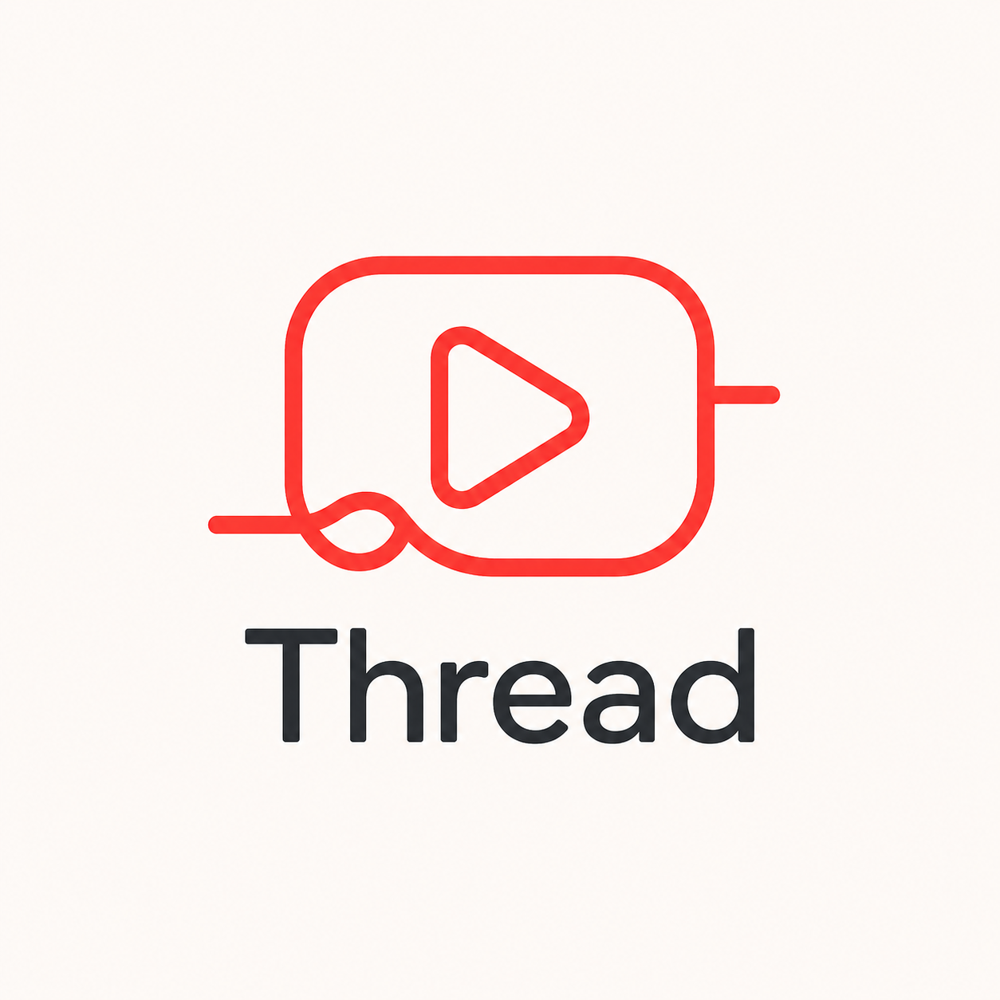

# Thread — Focus for YouTube

A personal project when I realized that I was spending more time than I wanted on YouTube, but I didn't want to cut myself off from such a powerful tool. So I made a Chrome/Edge Manifest V3 extension to enforce intentional YouTube use. Feedback is welcome and appreciated!

## Core Features
- Blocks YouTube when no session is active
- Learn sessions with topic/goal reflection
- **Semantic relevance engine (local, no API key)** for Learn mode
- Relevance verdict: `relevant` / `borderline` / `irrelevant`
- YouTube SPA navigation detection (recommendations, search-result clicks, back/forward)
- Early "Checking relevance..." blocking overlay before verdict
- Relax sessions with timed boundaries and warnings (15/10/5/1)
- Session end closes YouTube tabs
- Local analytics dashboard + threshold calibration recommendations

## Privacy
- All data is stored locally in `chrome.storage.local`
- No cloud sync
- No account required
- No external inference API calls

## Semantic Behavior
- Learn intent text uses BGE's retrieval query instruction with required session fields: `I want to learn about {topic}. This is my goal: {goal}.`
- Video text uses lightly labeled metadata fields: `Title: {title}` and `Description: {description}`
- Semantic scoring is mandatory before Learn verdict
- Session intent embeddings are cached for the active Learn session and reused across video checks when both the session ID and normalized intent text match
- The cached session intent embedding is cleared when the active session changes or ends
- Video metadata embeddings are still computed per video
- Keyword score is retained as diagnostic telemetry only

## Semantic Performance
- BGE model loading/warmup is separate from per-video relevance scoring
- The first scored video in a Learn session embeds both the session intent and the video metadata
- Later videos in the same Learn session reuse the cached session intent embedding and only embed the new video metadata
- BGE score/status metadata may include cache fields such as the cached session ID and cached intent text for debugging

## Install (Developer Mode)
1. Open `chrome://extensions` (or `edge://extensions`)
2. Enable **Developer mode**
3. Click **Load unpacked**
4. Select the `youtube-intent-guard` folder

## Blocked Page Recovery (No Active Session)
- If YouTube is blocked with “No active session”, you can now start directly in-page:
  - Click **Start Learn Here** to open a Learn modal.
  - Click **Start Relax Here** to open a Relax modal.
- Submitting either modal starts a session immediately and unblocks normal flow.

## Troubleshooting
- If you ever see extension startup timing errors on YouTube, reload the tab after updating the extension.
- If the extension icon is not visible, use Chrome’s Extensions menu (puzzle icon) to open the popup.
